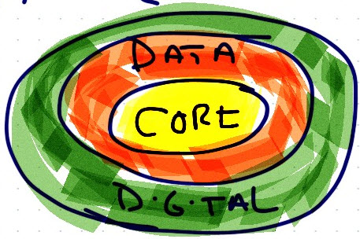

# Connections 2015 Notes

## Day 1 Monday, November 2nd

### Opening Keynote, Marcus Ryu, Guidewire Connections

Shaking things up - disruption e.g., [Trov](http://www.trov.com/) - hiding insurance sales in a gamified app that automatically categorizes and tracks important information about your stuff, including recipts.

**Big message**: Analytics and data visualization are the new drivers of everything.

Product leak: Guidewire Live is moving to the cloud. More products to follow, including Rating.

Near future: Expect an embrace of the federated services model, enabling cloud deployments both on premise and hosted. Expect more 3rd party integrations driven by IoT. [Thunderhead example cited](http://www.thunderhead.com/smart-communications-resources/solution-brief-thunderhead-and-guidewire-integration/)

More near future: Expect new integration and orchestration services, targeting specific value streams such as FNOL.

#### Architectural Emphasis

### Partner Break/Networking

HP Empower looks to have the potential to replace our ELG services. Uses product set we already own as part of ExStream, but adds a "thin client" for document administration and work flow.

### Enabling the Digital future
#### Ayan Sarkar, Product VP

[Link to Presentation video](http://fast.wistia.net/embed/iframe/9g5u79jhpq)

Take away: Consumers are at the heart of the Digital Revolution.

Companies that are killing it:

* [Kilimo Salama](https://kilimosalama.wordpress.com/): providing agriculture protection in the third world using state of art on the ground sensors with an all mobile (SMS) delivery solution. Built to work with the least cutting edge/most available mobile technology.
* [MetroMile](https://www.metromile.com/insurance/): Pay as you go car insurance. Great case of micro-segmentation product - those that drive less than 10k miles per year. Inexpensive monthly base payment plus roughly $0.03 per mile. Includes add on services such as Navigation, location services, etc.

Take Away #2: Companies should pivot their value proposition focusing on the consumer, using digital as the delivery mechanism.

Elements of the Digital future
* Digital Experience
* Digital Operations
* Disruptive Digtital Relationships

Self Service and Straight through processing are seen as keys to reducing TCO.

Keywords: micro segmentation, omnichannel.

**Core Design Priciples**

* Customer first: Delight the customer
* omnichannel and Personalized
* Seamless integration with Core & data Analytics
* 24x7 & highly scalable
* Strategic partnerships

**Customer at the Center**

* Build long term Relationships via Digital Experience
* Consumers are driven primarily by peer reviews
* Embed the product seamlessly into the customer's life style
* 2-way digital communication is a must have

**The Agent Journey**

* Much more complex than Consumers
* Much higher expectations

**Digital Landscapes**

| | |
|:---:|:---:|
| consumers | agents/brokers |
| commercial customer | vendors |

| | | |
|:---:|:---:|:---:|:---|:---:|
| Self services | Assisted Services | Delegated Services |

**Elements of the Journey**

* Transaction with APIs
* Omnichannel
* Deep pesonalization
* Prescriptive Analytical models
    * test & learn
* Self and Guided Navigation

### The Game Revolution

[Link to presentation video](http://fast.wistia.net/embed/iframe/p0b1i9rsbz)

**Gamificaion** Not just a game.

* Build awareness
* Build image
* Educate

Solve real world problems with game elements and game design and drive behavior.

Generally used externally.

Basic gaming elements
* points
* challenges
* badges
* social
* rewards
* leader boards
* levels
* content unlocking
* achievements

More elements
* Boss fights
* quests
* combat
* virtual goals
* gifting
* avatars
* constraints
* collections

Gamification has to fun. It requires elements of surprise to keep players engaged.

Gaming models
* Winning vs. Vanquishing
* Problem solving
* Recognition
* Exploring
* Teamwork
* Sharing
* Imagination
* Goofing off

LinkedIn got a huge benefit - in terms of data to mine - after they added gaming elements (progress meters) to their personal profile service.

Rewards are essential. How they're awarded and how they're received are equally important.
* Tangible e.g., t-shirts
* intangible e.g., points

Gaming Apps Cited
* John Hancock's Vitality Program
    * driven by a free FitBit, challenges, and rewards of real savings.
* Someone Else
    * Free Nest unit, drives behavior changes.

Use cases for investing in Gamification.
* Improve brand
* Generate quotes
* Educate customers
* Shift interaction patterns
* Change customer behavior
* Improve employee productivity
* Increase employee efficiency
* On-boarding & training
* Change employee behavior

**Legal Issues** Things to watch out for:
* Privacy concerns
* Employment & Labor laws
* Deceptive Marketing
* Affordable Care Act
* Intellectual Property
* Paid endorsements
* Sweepstakes & Gambling
    * Skill vs. Chance

Two *horizontal* vendors:
* [Badgeville](http://www.badgeville.com/) Game, Reputation, and Social mechanics.
* [Playvox](http://www.playvox.com/) Workforce engagement

**Things to look for when choosing a vendor**
* Game engine / Rules engine
* Scalability
* Security
* NFRs
    * Company profile
    * Business models

Gamification is an emerging field. There are lots of techniques, and lots of challenges. Start small!

To get started, have a clear strategy. Establish cross functional governance, and align to process and culture. Invest only in flexible technology.

Make sure your strategy includes mobile, cloud and data.

Invest heavily in measurement of success.

### MetLife: Taking Customer Portals to the Next Level

* [Link to presentation deck](http://guidewireconnections2015.pathable.com/static/attachments/125496/1446778947.pdf?1446778947)
* [Link to presentation video](http://fast.wistia.net/embed/iframe/uzsdkfehgr)

**Guiding Principle**: All Digital experience, all products.

Avoid a "lift and shift" approach to legacy rules and priorities.

Guidewire Products used:
* Policy Center
* Billing Center
* Account Management
* Quote and Buy

So far, MetLife has:
* A custom Claims FNOL Portal
* Integration to existing systems
* Quote & App are web only.

MetLife has no plans to implement ClaimCenter. Instead, they chose to integrate to their legacy Claims application by exposing SOAP services. Big downside, and a compromise of Principle: after all the digital experience, the response from the Claims application is a phone call.

Partners MetLife used:
* AI: Designing UX
* EY Delivery and Testing
* Guidewire: Portal expertise

So far, MetLife has made few changes to their minimal viable product specification.

System Integration testing took two months, followed by six weeks of UAT, then go live.

Prefill is a must have, and it must be backed up with integration to public domain services.

However, prefill isn't always 100% accurate.

When they started, the Guidewire portal lacked self-service capabilities. These were added in release 4, driven by MetLife requirements, and developed in the Dublin development center.

MetLife has decided against native app development, choosing a responsive web design instead.

**Portal testing is unique!**

For usability testing:
* Focus groups were employed
* Early adopters feedback mechanism
* Everyone's a UX expert!

Three components of performance testing:
* End to end quote duration
* Screen to Screen
* Rating

Production notes:
* Monitoring is key
    * MetLife captures 50 key data metrics
        * but, they're correlated manually

Future plans:
* A/B testing
* More analytics

Accelerators used:
* DocuSign
* Oracle

### Break Out Session: Guidewire Infrastructure Best Practices Overview
Presenter:
Dan Dunkle
Principle Implemenentation Architect
Guidewire

[Presentation Deck pdf](http://guidewireconnections2015.pathable.com/static/attachments/125504/1446780636.pdf?1446780636)

[Session Video](http://fast.wistia.net/embed/iframe/c83xfjx1bg)
